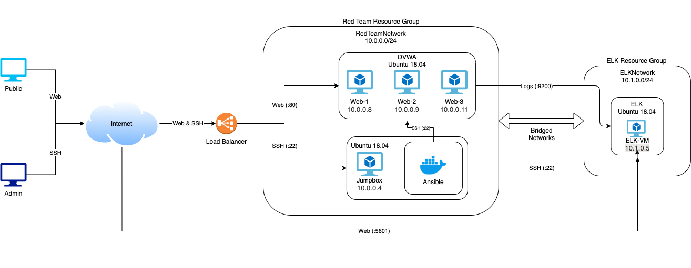
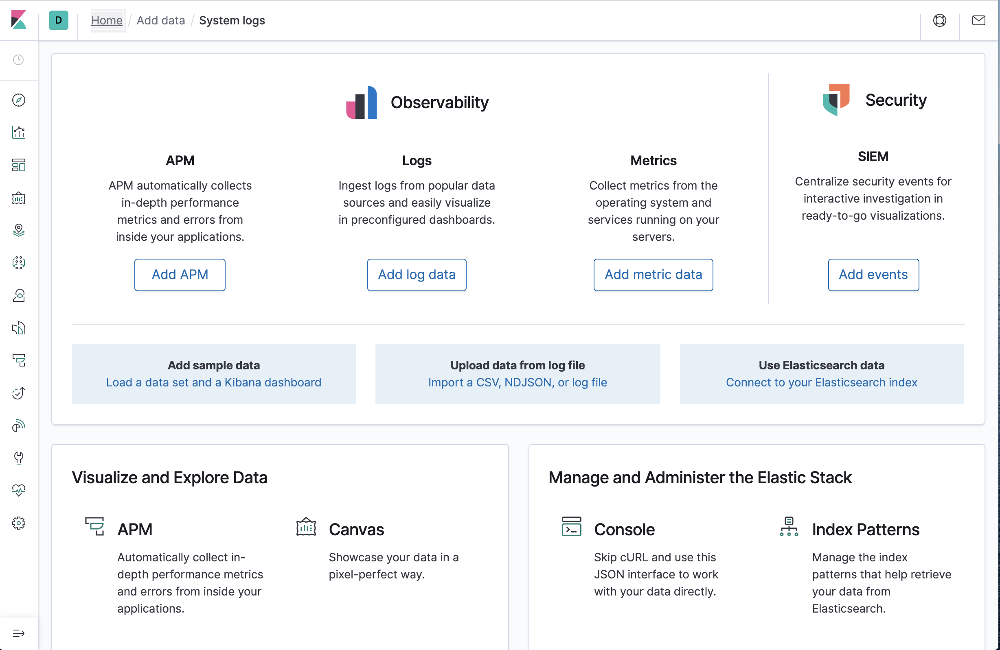

## Automated ELK Stack Deployment

The files in this repository were used to configure the network depicted
below.



These files have been tested and used to generate a live ELK deployment on
Azure. They can be used to either recreate the entire deployment pictured
above. Alternatively, select portions of the Ansible folder may be used to
install only certain pieces of it, such as Filebeat.

This document contains the following details:
- Description of the Topology
- Access Policies
- ELK Configuration
- Beats in Use
- Machines Being Monitored How to Use the Ansible Build


### Description of the Topology

The main purpose of this network is to expose a load-balanced and monitored
instance of DVWA, the D*mn Vulnerable Web Application.

Load balancing ensures that the application will be highly available, in
addition to restricting access to the network.

Integrating an ELK server allows users to easily monitor the vulnerable VMs
for changes to the system and system services.

The configuration details of each machine may be found below.

| Name     | Function | IP Address | Operating System |
|----------|----------|------------|------------------|
| Jump Box | Gateway  | 10.0.0.4   | Linux (Ubuntu 18.04|
| Web-1    | Web      | 10.0.0.8   | Linux (Docker)   |
| Web-2    | Web      | 10.0.0.9   | Linux (Docker)   |
| Web-3    | Web      | 10.0.0.11  | Linux (Docker)   |
| ELK-VM   | ELK      | 10.1.0.5   | Linux (Docker)   |

### Access Policies

The machines on the internal network are not exposed to the public Internet.

Only the Jump Box machine can accept connections from the Internet. Access to
this machine is only allowed from the following IP addresses:
- 76.40.166.206

A summary of the access policies in place can be found in the table below.

| Name     | Publicly Accessible | Allowed IP Addresses |
|----------|---------------------|----------------------|
| Jump Box | Yes                 | 76.40.166.206        |
| Web-1    | No                  | 10.0.0.4             |
| Web-2    | No                  | 10.0.0.4             |
| Web-3    | No                  | 10.0.0.4             |
| ELK-VM (Web)| Yes              | 76.40.166.206        |
| ELK-VM (Filebeat)| No          | 10.0.0.0/24        |

### Elk Configuration

Ansible was used to automate configuration of the ELK machine. No
configuration was performed manually, which is advantageous because it saves
time and provides a reproducible environment.

The playbook implements the following tasks:
    1. Conifgures the VM to use enough RAM
    2. Installs docker
    3. Installs pip3 from the apt repositories
    4. Installs the docker python module from pip
    5. Downloads the ELK docker container
    6. Enables docker to run on boot

The following output displays the result of running `docker ps` after
successfully configuring the ELK instance.

```bash
sysadmin@ELK-VM:~$ sudo docker ps
CONTAINER ID        IMAGE               COMMAND                  CREATED             STATUS              PORTS                                                                              NAMES
70f33ba99871        sebp/elk:761        "/usr/local/bin/star…"   2 days ago          Up About a minute   0.0.0.0:5044->5044/tcp, 0.0.0.0:5601->5601/tcp, 0.0.0.0:9200->9200/tcp, 9300/tcp   elk
```

### Target Machines & Beats This ELK server is configured to monitor the following machines:
    - Web-1 (10.0.0.8)
    - Web-2 (10.0.0.9)
    - Web-3 (10.0.0.11)

We have installed the following Beats on these machines:
    - Filebeats
    - Metricbeats

These Beats allow us to collect the following information from each machine:
    - Filebeats will read system logs to generate human-readable reports about
        the Linux system
    - Metricbeats listens to specific services to generate tailored logs and
        display metrics on the ELK stack

### Using the Playbook In order to use the playbook, you will need to have an Ansible control node already configured. Assuming you have such a control node provisioned:

SSH into the control node and follow the steps below:
1. Copy the `ansible/elk-playbook.yml` file to `/etc/ansible/elk-playbook.yml`
```bash
curl https://github.com/jackno/elk-stack/blob/master/ansible/elk-playbook.yml /etc/ansible/elk-playbook.yml
```
2. Update the `/etc/ansible/hosts` file to include the target VMs.
```
# Make sure to include python3 as your python interpreter
[elk]
<your-vm-ip>        ansible_python_interpreter=/usr/bin/python3
```
3. Run the playbook, and navigate to http://<your-vm-ip>:5601/app/kibana to
   check that the installation worked as expected. You should see the
   following page:


